# Dashboard cards

[← Documentation](README.md) · [Deutsch](de/karten.md)

The integration includes four cards. Home Assistant loads them automatically, so no dashboard resource and no separate HACS download are needed. Each card:

- has a visual editor and follows your theme (light or dark) and language (English or German);
- adapts to its width, from a phone to a wall tablet;
- finds your board by itself. With several boards, choose one in the editor.

To add one, edit a dashboard, select **Add card** and search for **Autodarts**.

## Live card

`custom:autodarts-card` shows the current visit, dart by dart, on a board drawn with the geometry of the Autodarts Board Manager.

<picture>
  <source media="(prefers-color-scheme: light)" srcset="images/en/card-light.png">
  
</picture>

- **Visit:** score, the three dart slots and a progress indicator. The latest dart is outlined.
- **Last visits:** the scores of your last five visits, coloured like the training card's chart. Hover one for its darts.
- **Practice game:** while a [practice game](entities.md#practice-game) runs, the remaining score, the checkout route and busts appear above the dart slots, and the board outlines the bed to aim at next. In a match, a scoreboard lists every player with the remaining score, legs, sets and average, and highlights the player at the board. In the [party games](entities.md#party-games), the panel shows the round, the target and every player's points or, in Killer, their number and lives. During a bull-off it lists the distance of every dart. In [Cricket](entities.md#cricket), a chalkboard shows the marks of every player on 20 to 15 and the bull, the points and the marks per round, dims the numbers everybody has closed and outlines the next open number on the board. In a [training game](entities.md#training-games), the panel shows the target, the progress, darts and hit rate (Bob's 27: points and round; checkout training: the route and the checkout rate), and the board outlines the beds of the target.
- **Board:**
  - Hit beds blink in the highlight colour.
  - Numbered markers show where each dart landed.
  - The board glows in the detection status colour: green when ready, yellow during a takeout, orange when stopped, purple while calibrating, red when offline or when a camera has a problem.
- **Training statistics:** darts, 3-dart average, triples, bulls and 180s of the session.
- **Connections:** Board Manager, realtime and cameras. Tap a chip for details.
- **Controls:** start or stop detection, reset detection and calibrate. Resetting and calibrating need a second tap to confirm.

Tap the board, or press Enter on it, to open the visit details.


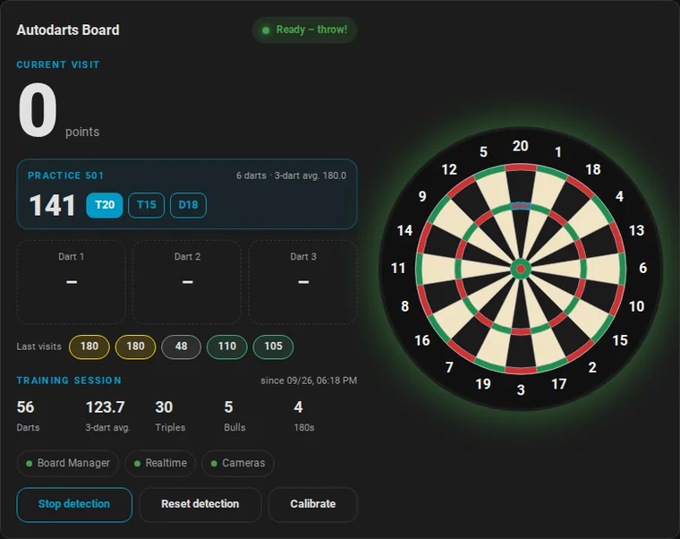

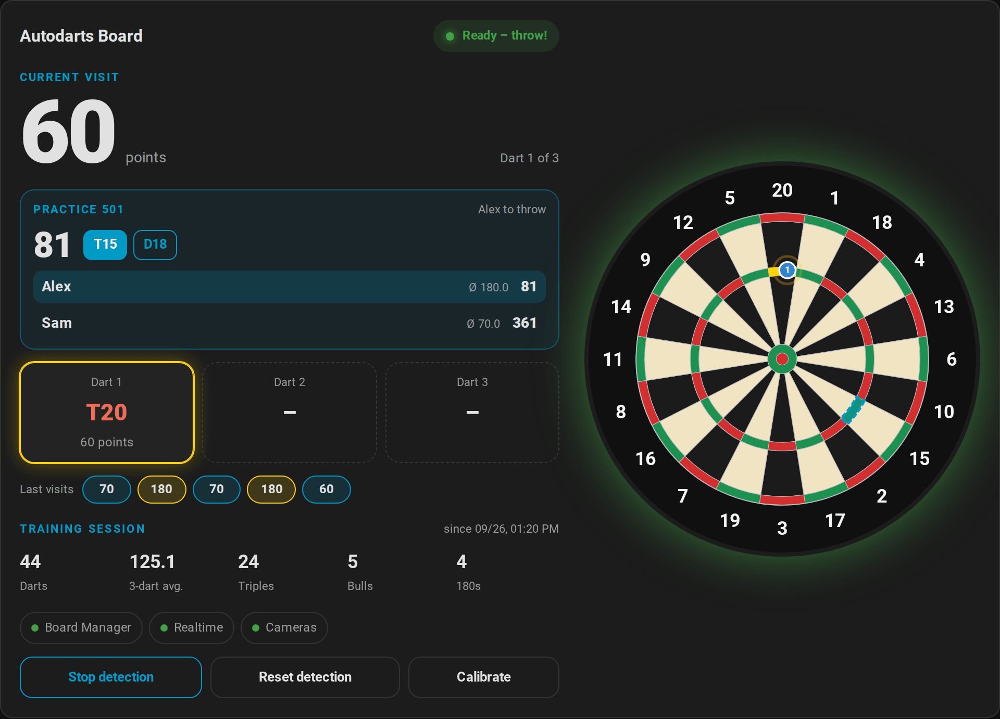

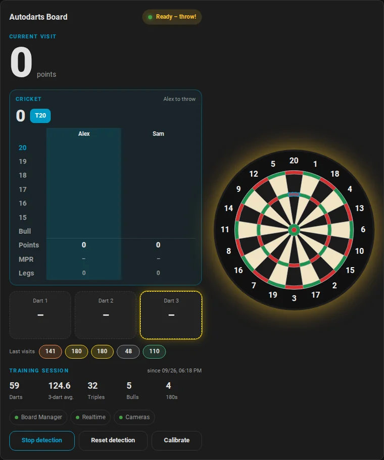

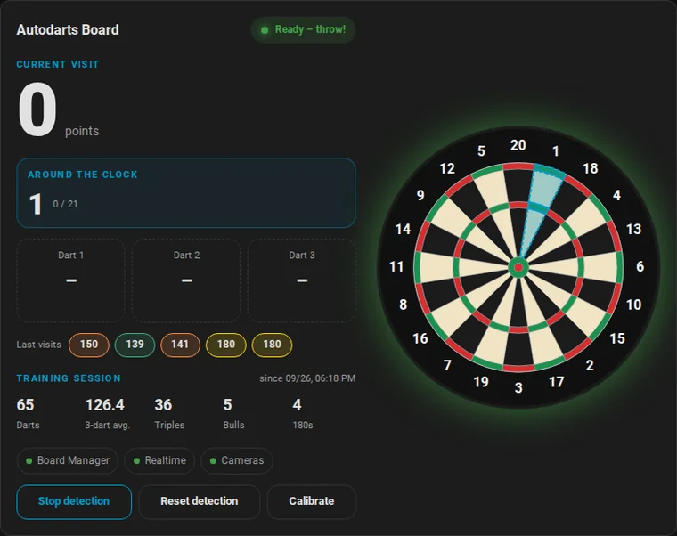

### Options

| Option | Values | Default | Description |
| --- | --- | --- | --- |
| `device_id` | device | first board | The board to show |
| `title` | text | board name | Card title |
| `layout` | `auto`, `horizontal`, `vertical`, `board` | `auto` | Board on the right, board below, or board only. `auto` switches to vertical on narrow cards |
| `board_style` | `classic`, `autodarts` | `classic` | Classic board with wires, or the flat Autodarts look |
| `highlight` | `visit`, `last`, `none` | `visit` | Highlight all darts of the visit, only the last one, or none |
| `blink` | boolean | `true` | Blink the hit beds |
| `show_markers` | boolean | `true` | Show dart positions |
| `show_numbers` | boolean | `true` | Show the numbers around the board |
| `show_stats` | boolean | `true` | Show the training statistics |
| `show_recent` | boolean | `true` | Show the last visits |
| `show_practice` | boolean | `true` | Show the practice game and the bed to aim at |
| `show_connection` | boolean | `true` | Show the connection chips |
| `show_controls` | boolean | `true` | Show the controls |
| `accent_color` | CSS colour | theme primary colour | Labels and main button |
| `highlight_color` | CSS colour | `#ffd60a` | Hit beds and the latest dart |

<table>
  <tr>
    <td>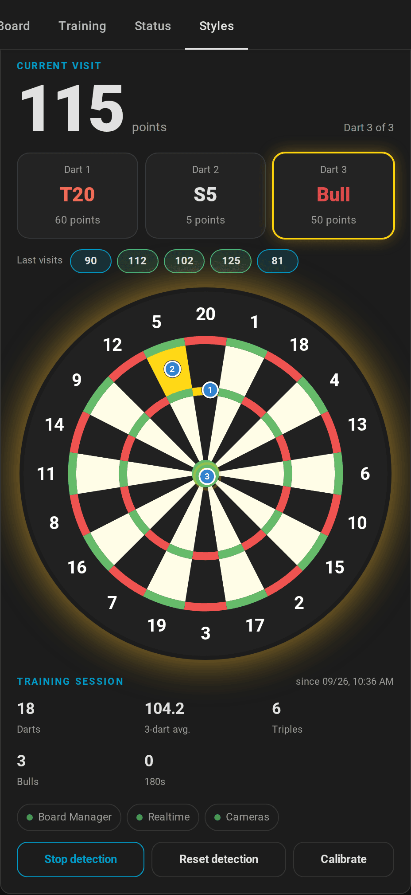</td>
    <td>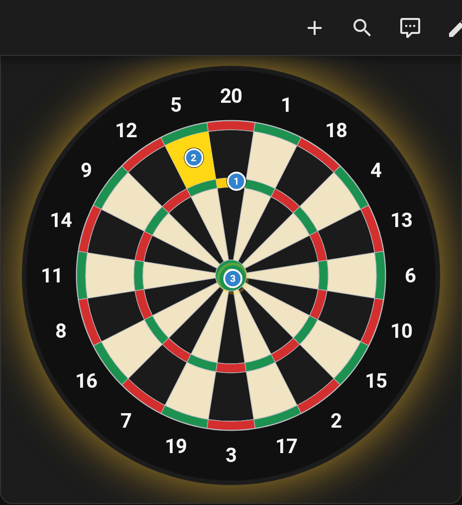</td>
  </tr>
  <tr>
    <td align="center"><code>layout: vertical</code>, <code>board_style: autodarts</code></td>
    <td align="center"><code>layout: board</code></td>
  </tr>
</table>

```yaml
type: custom:autodarts-card
layout: vertical
board_style: autodarts
highlight: last
highlight_color: "#00e5ff"
```

## Training card

`custom:autodarts-training-card` turns the local [training session](entities.md#training-session) into a dashboard you'll want to look at after every session.

<picture>
  <source media="(prefers-color-scheme: light)" srcset="images/en/training-card-light.png">
  
</picture>

- **3-dart average**, the number of darts and visits, and when the session started.
- **Streak and daily goal:** the [training streak](entities.md#personal-bests-streak-and-daily-goal) in days and today's darts, with a bar towards the daily goal that turns green when you reach it.
- **Heatmap:**
  - Every bed is coloured by how often you hit it, from blue (rarely) to red (most often).
  - Hover a bed for its count and share.
  - In `numbers` mode, the heatmap sums each number's singles, doubles and triples instead.
- **Statistics:** highest visit, 100+, 140+ and 180 visits, triple rate, doubles, bulls and misses. 180s light up in gold.
- **Most hit beds:** the top five, with count and share of all darts.
- **Recent visits:** a bar chart of your last visits with the session average as a dashed line.
  - Bars are coloured grey below 60, accent colour from 60, green for 100+, orange for 140+ and gold for 180.
  - The visits come from the recorder, so the chart survives page reloads.
- **Past sessions:** end time, duration, darts, 3-dart average and best visit of your last five finished sessions.
- **Session controls:**
  - *Start session* and *End session* switch the [training session](entities.md#training-session) on and off. Ending needs a second tap to confirm.
  - *New session* ends the running session and starts the next one, also after a second tap.
  - The line next to the buttons tells whether a session is running or when the last one ended.

### Options

| Option | Values | Default | Description |
| --- | --- | --- | --- |
| `device_id` | device | first board | The board to show |
| `title` | text | *Training · board name* | Card title |
| `mode` | `beds`, `numbers` | `beds` | Heatmap per bed or per number |
| `board_style` | `muted`, `classic`, `autodarts` | `muted` | The muted board lets the heatmap stand out |
| `history_size` | 5–60 | `20` | Visits in the chart; labels are shown up to 30 |
| `show_heatmap` | boolean | `true` | Show the heatmap |
| `show_stats` | boolean | `true` | Show the statistics tiles |
| `show_top` | boolean | `true` | Show the most hit beds |
| `show_history` | boolean | `true` | Show the recent visits |
| `show_sessions` | boolean | `true` | Show the past sessions |
| `show_reset` | boolean | `true` | Show the session controls |
| `accent_color` | CSS colour | theme primary colour | Labels and 60+ visits |

```yaml
type: custom:autodarts-training-card
mode: numbers
history_size: 40
show_reset: false
```

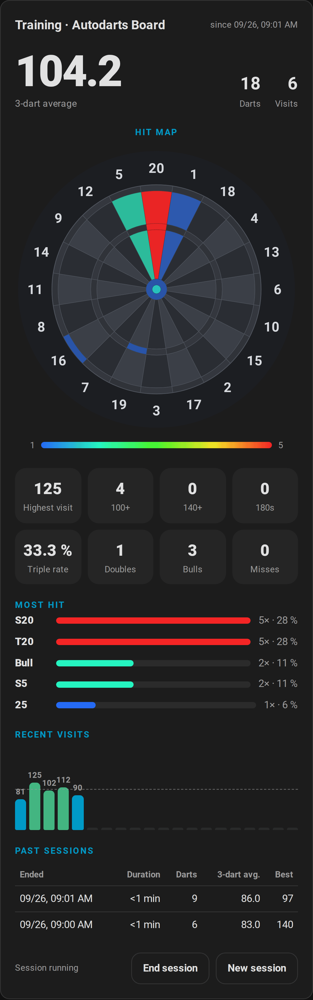

## Board status card

`custom:autodarts-status-card` shows the health of the board and gathers the maintenance actions in one place.

<picture>
  <source media="(prefers-color-scheme: light)" srcset="images/en/status-card-light.png">
  
</picture>

- **Detection:** a switch with the current status, tinted in the status colour.
- **Board Manager:** the installed version and, with Board Manager 2, a badge for an available update. Tap the badge for its details.
- **Connections:** Board Manager, realtime and the cloud connection of the board.
- **Board PC** (Board Manager 2): CPU and memory load, plus the detection frame rate if you enabled it.
- **Cameras:** a tile for every camera with its status and frame rate (if the frame-rate sensor is enabled) and its own calibration. A camera with a problem turns red.
- **Maintenance:** calibrate, reset detection and restart Board Manager. Each needs a second tap to confirm.

### Options

| Option | Values | Default | Description |
| --- | --- | --- | --- |
| `device_id` | device | first board | The board to show |
| `title` | text | board name | Card title |
| `show_connection` | boolean | `true` | Show the connections |
| `show_system` | boolean | `true` | Show the board PC load |
| `show_cameras` | boolean | `true` | Show the cameras |
| `show_controls` | boolean | `true` | Show the maintenance buttons |
| `accent_color` | CSS colour | theme primary colour | Labels and the detection switch |

```yaml
type: custom:autodarts-status-card
show_system: false
```

## Scoreboard card

`custom:autodarts-scoreboard-card` is made for a tablet or TV next to the board: large enough to read from the oche, and it always shows what is being played.

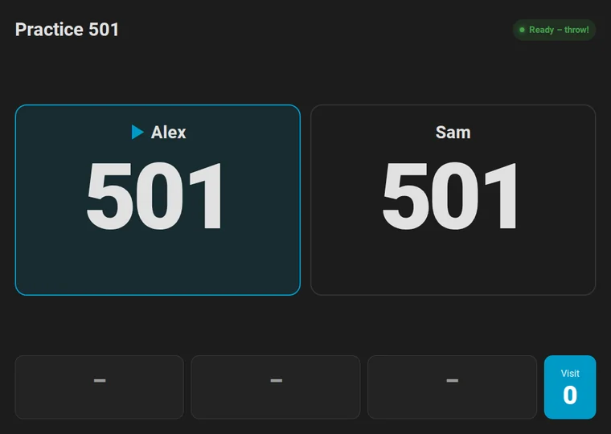

- **X01:** a tile for every player with the remaining score, legs, sets and average. The player at the board is outlined and gets the checkout route, a bust or the game shot.
- **Cricket:** a large chalkboard with the marks of every player, the points and the marks per round; the next open number is shown below.
- **Party games:** the round and the target, every player's points, or in Killer their number and lives in red hearts.
- **Bull-off:** the distance of every player's dart from the centre.
- **Training games:** the target in large type, with the progress, darts and hit rate (Bob's 27: points and round; checkout training: the score, the route and the checkout rate).
- **Between games:** the score of the current visit together with darts, 3-dart average, highest visit and 180s of the training session, the training streak and today's darts towards the daily goal.
- **Winner:** a banner names the winner of the match until the next dart.
- **Visit:** the three darts of the current visit and its score along the bottom.

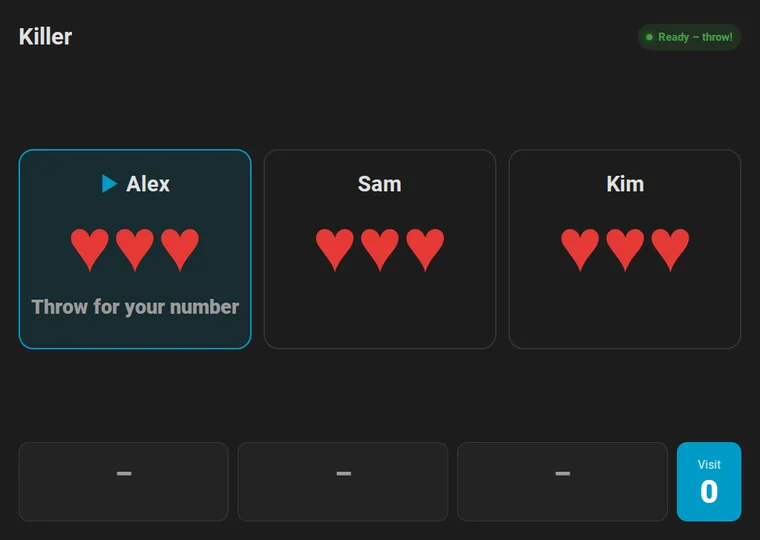

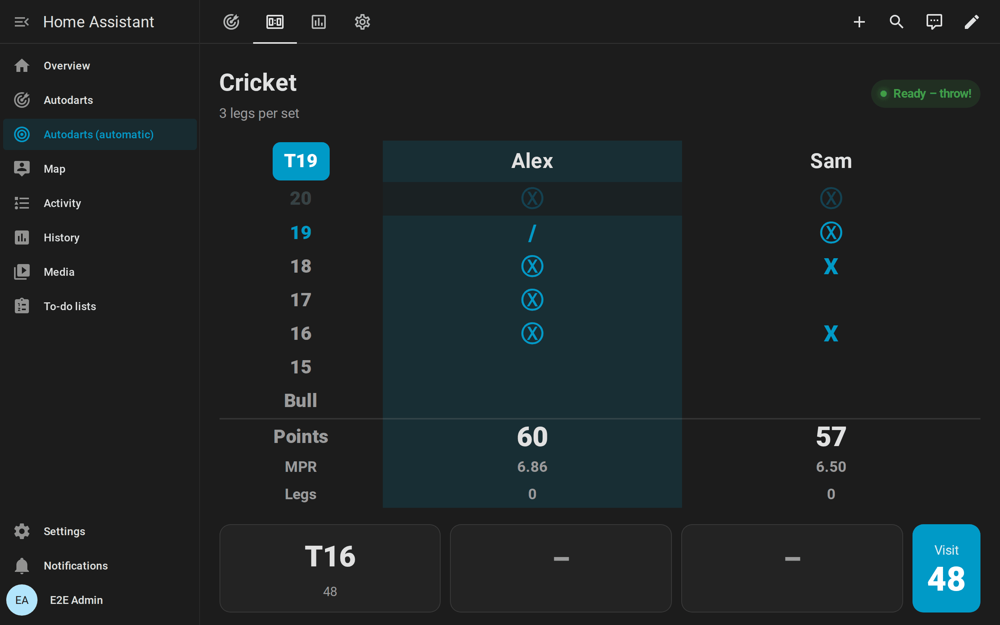

The [automatic dashboard](#automatic-dashboard) has a *Scoreboard* view that shows the card across the whole screen. Open it on the tablet, and use the browser's full-screen mode or the Home Assistant app in kiosk mode.

### Options

| Option | Values | Default | Description |
| --- | --- | --- | --- |
| `device_id` | device | first board | The board to show |
| `full_height` | boolean | `false` | Fill the height of the screen, for a view in panel mode |
| `show_visit` | boolean | `true` | Show the darts of the current visit |
| `show_status` | boolean | `true` | Show the board status |
| `accent_color` | CSS colour | theme primary colour | The player at the board, routes and the visit score |

```yaml
type: custom:autodarts-scoreboard-card
full_height: true
```

## Automatic dashboard

Instead of arranging the cards yourself, let the integration build a whole dashboard:

1. Go to **Settings → Dashboards → Add dashboard**.
2. Choose **Autodarts**.

For every board, the dashboard gets four views, which update themselves when you add a board or enable entities:

| View | Contents |
| --- | --- |
| **Live** | The live card across the full width, the practice game controls and the player names |
| **Scoreboard** | The [scoreboard card](#scoreboard-card) across the whole screen, for a tablet or TV at the board |
| **Training** | The training card, the daily goal with darts today, the streak and the last personal best, darts per day for the last 30 days (from long-term statistics, which Home Assistant compiles hourly), the 3-dart average of the last 7 days, practice legs per day, and the first 9 average and checkout rate of the practice game |
| **Board** | The board status card, the board settings and the Board Manager update |

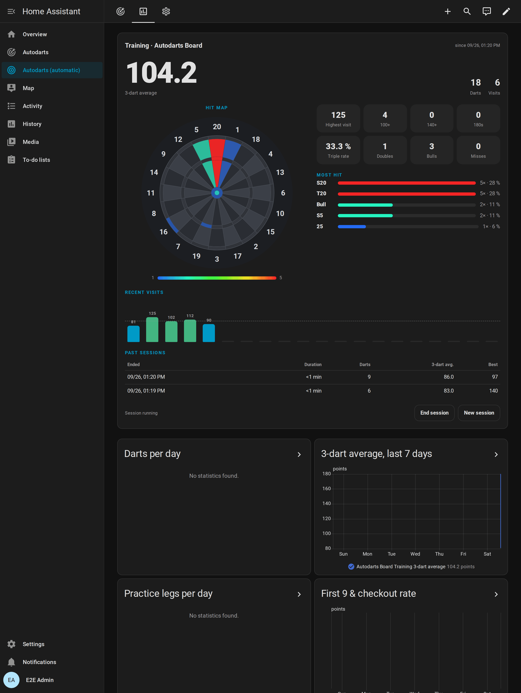

In YAML, the whole dashboard is one line; `device_id` and `title` are optional:

```yaml
strategy:
  type: custom:autodarts
  device_id: 0123456789abcdef   # only this board
  title: Darts
```

To customise it, open the dashboard's menu (⋮) → **Edit dashboard** → **Take control**. Home Assistant then turns the generated views into a normal dashboard that you can edit.

## Card editor

All options can be set in the visual editor, which offers only Autodarts boards in its device picker.

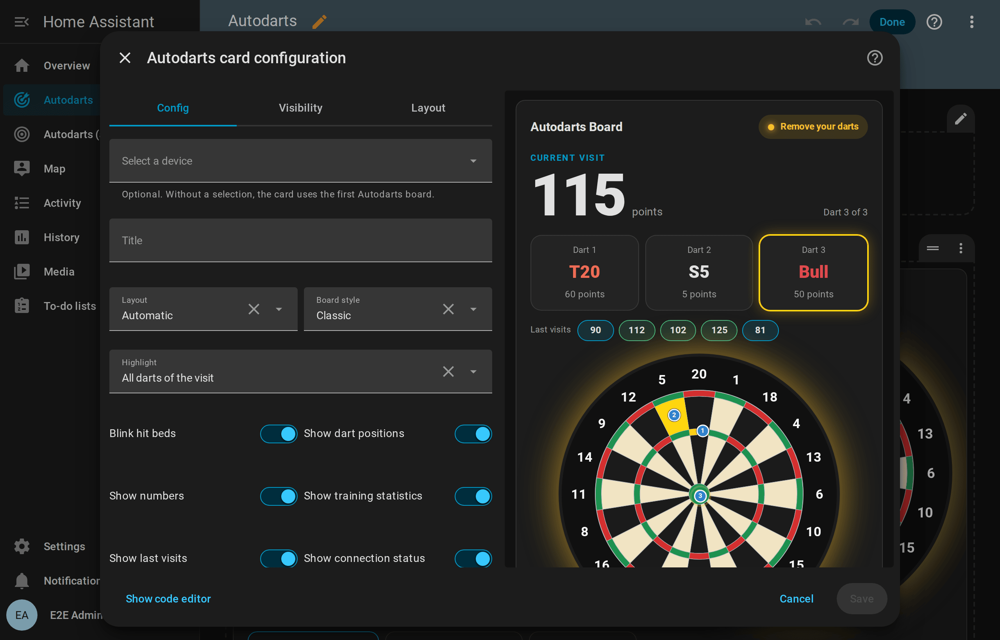

## Tips

- **Wall tablet:** the live card with `layout: vertical` fills a portrait screen. The board scales with the card. For a landscape screen at the board, use the [scoreboard](#scoreboard-card).
- **Combine:** put the live card and the training card next to each other in a sections view with two columns.
- **Several boards:** add one card per board and choose the board in each card's editor.
- **Cached old version:** after an update, the card URL changes automatically. If a browser still shows an old card, reload the page. In the companion app, use *Settings → Companion app → Debugging → Reset frontend cache*.
