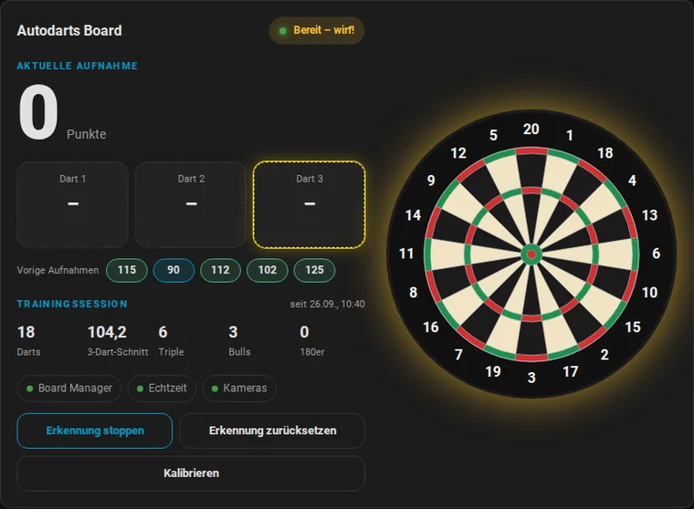
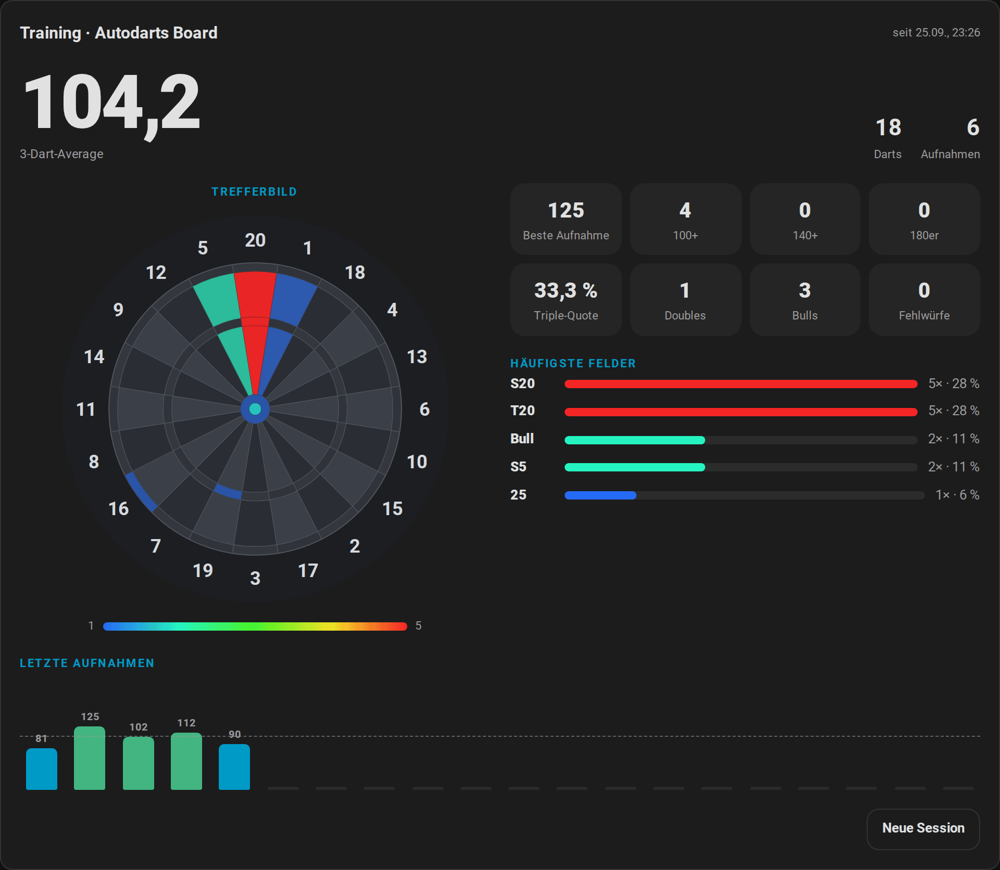
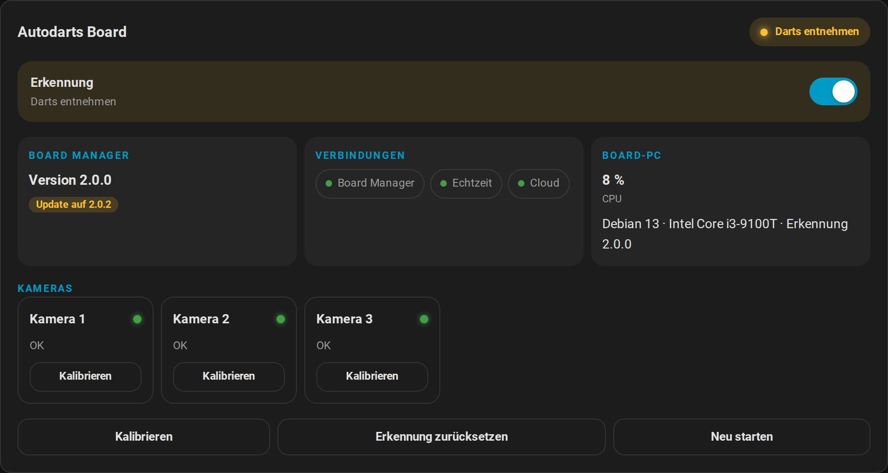
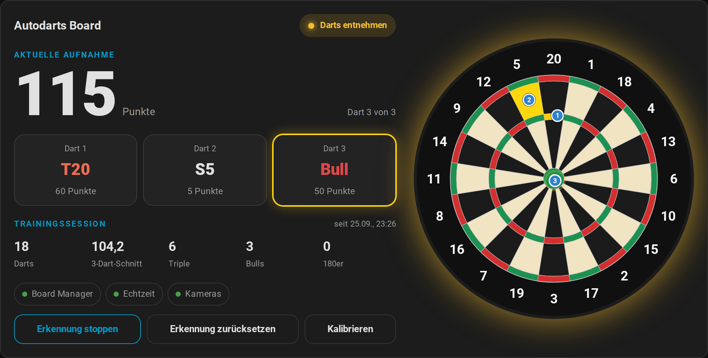
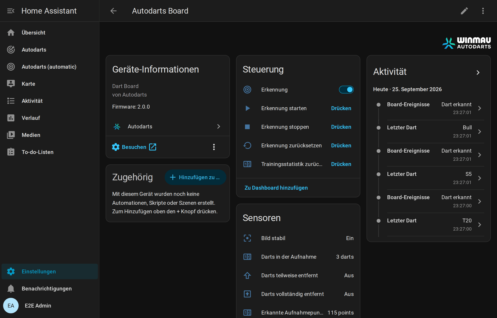

# Autodarts für Home Assistant

[← Projektseite](../../README.md) · [English documentation](../README.md)

**Dein Autodarts-Board live in Home Assistant: lokal, in Echtzeit und bereit für Automationen.**

## Das kann die Integration

- **Lokal und in Echtzeit.**
  - Direkte Verbindung zum Autodarts Board Manager in deinem Netzwerk.
  - Darts erscheinen in Sekundenbruchteilen.
  - Kein Cloud-Konto und keine Client-ID nötig.
- **Findet dein Board automatisch.**
  - Board Manager 2 meldet sich selbst im Netzwerk; Home Assistant bietet das Board mit einem Klick an.
  - Alternativ suchst du nach deinen Boards oder gibst die Adresse ein.
- **Beide Board-Manager-Generationen.** Unterstützt den klassischen Board Manager 1 und den Headless Board Manager 2. Nach einem Update stellt sich die Integration selbst um.
- **Drei Dashboard-Karten**, die automatisch geladen werden:
  - Live-Dartscheibe mit blinkenden Treffern und Dart-Positionen;
  - Trainingskarte mit Trefferbild und Aufnahmeverlauf;
  - Board-Status mit Erkennung, Verbindungen und Kameras;
  - dazu ein automatisches Dashboard, das alles pro Board mit einem Klick anordnet.
- **Trainingsanalyse:**
  - 3-Dart-Average, Aufnahmen, höchste Aufnahme, 100+/140+/180, Triple-Quote;
  - Treffer pro Feld, lokal gespeichert und über Neustarts hinweg erhalten.
- **Automationen mit Bühnenatmosphäre.**
  - Board-Ereignisse für jeden Dart, jede Korrektur, jede Entnahme und jede abgeschlossene Aufnahme.
  - Sechs fertige Blueprints: 180-Feier, Dart-Caller, Licht bei der Entnahme, automatische Erkennung, Warnungen und tägliche Berichte.
- **Volle Kontrolle.**
  - Erkennung starten, stoppen und zurücksetzen.
  - Kalibrierung für das Board oder einzelne Kameras; Board Manager neu starten.
  - Board-Einstellungen, Kamera-Standby und Updates.
  - Zustandssensoren für jede Kamera.
- **Robust.**
  - Erfüllt alle Regeln der [Qualitätsskala für Home-Assistant-Integrationen](https://developers.home-assistant.io/docs/core/integration-quality-scale/) bis Platin ([Selbsteinschätzung](../../custom_components/autodarts/quality_scale.yaml)), einschließlich strikter Typisierung.
  - Stellt Verbindungen selbst wieder her und meldet eine falsche Board-Adresse unter Reparaturen.
  - Diagnosedaten ohne Geheimnisse.
  - Auf Deutsch und Englisch.
  - Rund 300 automatische Tests, darunter ein Docker-End-to-End-Test mit beiden Board-Manager-Generationen und ein Browsertest jeder Karte.

## Schnellstart

1. **Mit HACS installieren.**

   

   Alternativ fügst du `https://github.com/Dennis-Otto/HACSAutodarts` in HACS als benutzerdefiniertes Repository vom Typ **Integration** hinzu. Dann installierst du **Autodarts** und startest Home Assistant neu.

2. **Board hinzufügen.** Mit Board Manager 2 erscheint dein Board meist schon unter **Einstellungen → Geräte & Dienste → Entdeckt**. Sonst:

   

   Wähle **Boards im Netzwerk suchen** oder **Board-Adresse eingeben** und bestätige. Konto, Passwort oder Client-ID brauchst du nicht.

3. **Karten hinzufügen.** Bearbeite ein Dashboard, wähle **Karte hinzufügen** und suche nach *Autodarts*. Oder erzeuge in einem Schritt ein komplettes Dashboard: **Einstellungen → Dashboards → Dashboard hinzufügen → Autodarts**.

## Bilder

<table>
  <tr>
    <td width="50%">
<b>Trainingskarte</b>
</td>
    <td width="50%">
<b>Board-Status</b>
</td>
  </tr>
  <tr>
    <td width="50%">
<b>Live-Karte</b>
</td>
    <td width="50%">
<b>Geräteseite</b>
</td>
  </tr>
</table>

## Anleitungen

| Anleitung | Inhalt |
| --- | --- |
| [Installation und Einrichtung](installation.md) | Voraussetzungen, HACS, manuelle Installation, Einrichtung, Cloud-Verknüpfung, Updates, Entfernen |
| [Entitäten und Ereignisse](entitaeten.md) | Alle Entitäten, Board-Ereignisse, Zustände und Attribute |
| [Dashboard-Karten](karten.md) | Live-Karte, Trainingskarte und Board-Status mit allen Optionen |
| [Automationen](automationen.md) | Blueprints, Board-Ereignisse und fertige Beispiele |
| [Funktionsweise](funktionsweise.md) | Architektur, Aktualisierung, Trainingsregeln, Datenschutz |
| [Fehlerbehebung](fehlerbehebung.md) | Meldungen, Reparaturen, Diagnose und Logs |

Die Entwickler-Dokumentation gibt es auf Englisch: [Development](../development.md), [Releases](../releases.md).

## Unterstützte Geräte

| | Unterstützt | Getestet mit |
| --- | --- | --- |
| Board Manager 2 (Headless) | 2.x | 2.0.0 |
| Board Manager 1 (klassische App) | 1.x | 1.0.7 |
| Kameras | Jede Anzahl, die der Board Manager unterstützt | 3 |
| Home Assistant | ab 2026.8 | 2026.9.3 |

## Bekannte Einschränkungen

- **Cloud-Spieldaten sind noch nicht verfügbar.** Sie brauchen eine OAuth-Client-ID, die Autodarts für diese Integration vergibt; sie ist beantragt, aber noch nicht enthalten. Alles Lokale funktioniert ohne sie.
- **Keine Spiellogik im Training.** Das Training zählt die Darts, die das Board erkennt. Spieler, Legs, Überwerfen oder Checkouts kennt es nicht.
- **Board-Manager-Updates installierst du auf dem Board-PC.** Die Update-Entität zeigt neue Versionen von Board Manager 2 nur an.
- **Nur Standbilder.** Die Kamera-Entitäten liefern Standbilder; der Board Manager bietet Home Assistant keinen Videostream an.
