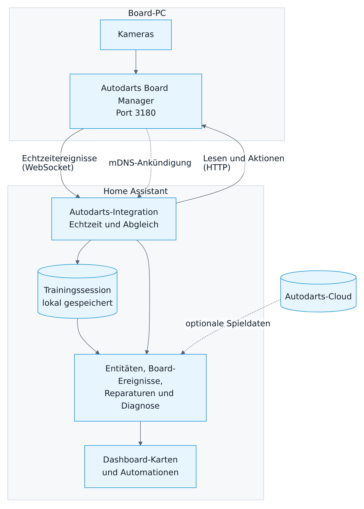

# Funktionsweise

[← Übersicht](README.md) · [English](../how-it-works.md)

## Architektur

<picture>
  <source media="(prefers-color-scheme: dark)" srcset="../images/de/architecture-dark.png">
  
</picture>

Ein Board ist ein Integrationseintrag mit bis zu zwei unabhängigen Verbindungen:

- **Lokal** (empfohlen): direkt zum Board Manager in deinem Netzwerk. Ohne Anmeldung; liefert Steuerung, Echtzeitereignisse und Training.
- **Cloud** (optional): Spieldaten von Autodarts. Fällt sie aus, läuft die lokale Steuerung weiter, und umgekehrt.

## Aktualisierung

| Quelle | Wie | Intervall |
| --- | --- | --- |
| Board-Zustand, Dart-Positionen, Bewegung, Kameras, Bildraten | WebSocket `/api/events` des Board Managers | Sofort |
| Abgleich, solange Echtzeitereignisse ankommen | HTTP-Lesen | Alle 30 Sekunden |
| Ersatz ohne Echtzeitereignisse | HTTP-Lesen | Alle 2 Sekunden |
| Board Manager 2 | Ein gemeinsamer Aufruf von `/api/system` pro Intervall | Wie oben |
| Einstellungen und Version bei Board Manager 1 | HTTP-Lesen | Alle 30 Sekunden und nach jeder Aktion |
| Cloud-Spieldaten | Autodarts-API | Während eines Matches alle 5 Sekunden, sonst jede Minute |

Weitere Details:

- **Wiederverbinden.** Bricht die Echtzeitverbindung ab, wechselt die Integration sofort auf schnelles Lesen. Danach verbindet sie sich mit wachsendem Abstand von 1 bis 60 Sekunden neu.
- **Keine veralteten Werte.** Ein langsames HTTP-Lesen überschreibt nie eine neuere Echtzeitnachricht.
- **Kurze Aussetzer.** Ein einzelner verpasster Lesevorgang zählt nicht als Ausfall, solange Echtzeitereignisse ankommen.
- **Nach einer Aktion.** Die Integration liest das Board direkt nach jeder Aktion; ein Schalter zeigt den neuen Zustand also nach etwa einer Sekunde.

## Board-Manager-Generationen

| | Board Manager 1 (klassische App) | Board Manager 2 (Headless) |
| --- | --- | --- |
| Erkennung | Version beginnt mit `1.` | Version beginnt mit `2.` und `/api/system` existiert |
| Lesen | Einzelne Aufrufe für Zustand, Statistik, Kameras, Bewegung, Einstellungen und Version | Ein gemeinsamer Aufruf von `/api/system` |
| Extras | Schalter für die Board-Cloud-Verbindung | Cloud-Verbindung, CPU, Speicher, Update-Hinweis, mDNS-Erkennung |

Die Generation wird bei jedem Lesen geprüft. Nach einem Update des Boards lädt sich die Integration neu und ergänzt oder entfernt die generationsspezifischen Entitäten; sonst ändert sich nichts. Solange ein Board noch Board Manager 1 nutzt, empfiehlt ein Reparaturhinweis das Update.

## Trainingssession

Die Trainingssession berechnet Home Assistant aus dem, was das Board erkennt. Sie folgt diesen Regeln:

- **Jeder Dart zählt einmal.** Wiederholte Nachrichten, Kamerazittern und Neuverbindungen zählen keinen Dart doppelt.
- **Korrekturen überarbeiten.** Korrigiert das Board einen Dart der aktuellen Aufnahme, folgen die Summen der Korrektur, etwa wenn aus einer 180 eine 140 wird.
- **Die Entnahme beendet die Aufnahme.** Die entfernten Darts behalten ihre Punkte. Dasselbe gilt, wenn neue Darts ohne leeres Board dazwischen erscheinen (verpasste Entnahme) und wenn die Erkennung stoppt.
- **Darts beim Start zählen nicht.** Darts, die beim Start von Home Assistant oder der Verbindung schon im Board stecken, werden nicht mitgezählt.
- **Zurückgezogene Erkennungen.** Nimmt das Board außerhalb einer Entnahme eine Erkennung zurück, verschwindet der Dart wieder aus den Summen.
- **Punktstufen.** 100+ zählt Aufnahmen mit 100–139 Punkten, 140+ mit 140–179, 180 genau drei Triple 20. Zusammengelegte Aufnahmen mit mehr als drei Darts (nach verpasster Entnahme) zählen in keine Stufe.
- **Speicherung.** Die Session liegt im Ordner `.storage` von Home Assistant. Sie wird höchstens alle fünf Sekunden und beim Beenden gespeichert und zusammen mit der Integration gelöscht.

Spieler und Spiele kennt die Session nicht. Sie zählt jeden erkannten Dart, egal ob du X01, Cricket oder freies Training spielst.

## Kamerazustand

Eine Kamera gilt als gestört, wenn sie bei laufender Erkennung **15 Sekunden** lang keine Bilder liefert. Gestoppte Erkennung, Kalibrierung und Kamera-Standby sind keine Störung. Der gemeinsame Sensor *Kamerastörung* ist an, sobald eine Kamera gestört ist.

## Datenschutz

- **Lokaler Betrieb:** Die Integration spricht nur mit dem Board Manager in deinem Netzwerk; ins Internet geht nichts.
- **Boards im Netzwerk suchen:** Fragt einmalig bei Benutzung `discover.autodarts.com`, den öffentlichen Suchdienst von Autodarts. Er sieht deine öffentliche IP-Adresse und liefert die von dort registrierten Boards.
- **Die optionale Cloud-Verknüpfung** nutzt die Geräteanmeldung von Autodarts. Home Assistant speichert OAuth-Token, nie dein Passwort.
- **Board-Geheimnisse** wie der API-Schlüssel des Boards, TLS-Schlüssel, Kamerapfade und ähnliche Konfiguration werden direkt beim Lesen verworfen. Sie werden nie gespeichert, protokolliert oder angezeigt.
- **Diagnosedaten** schwärzen Board-ID, Adresse, Client-ID und Token.

## Sicherheit

- Die lokale API des Board Managers verlangt keine Anmeldung. Jeder, der Port 3180 in deinem Netzwerk erreicht, kann sie nutzen, mit oder ohne Home Assistant. Betreibe den Board-PC in einem vertrauenswürdigen Netzwerk.
- Aktionen werden nur gesendet, wenn du oder eine Automation sie auslöst, und nie automatisch wiederholt.
