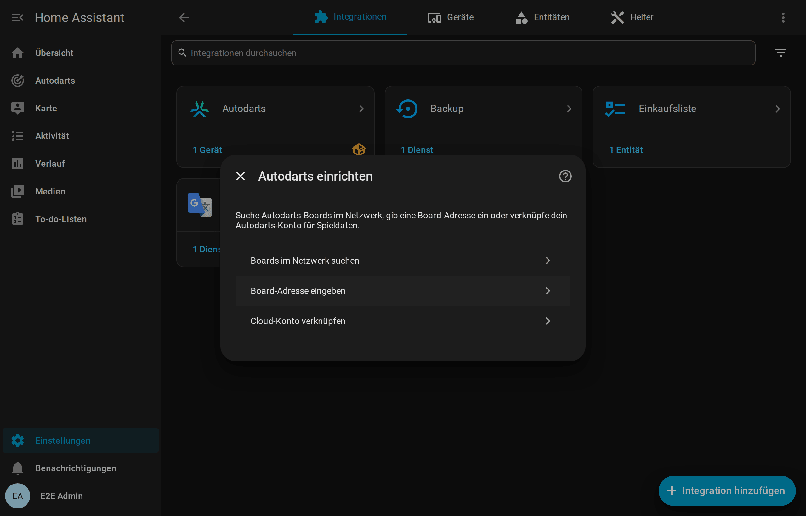
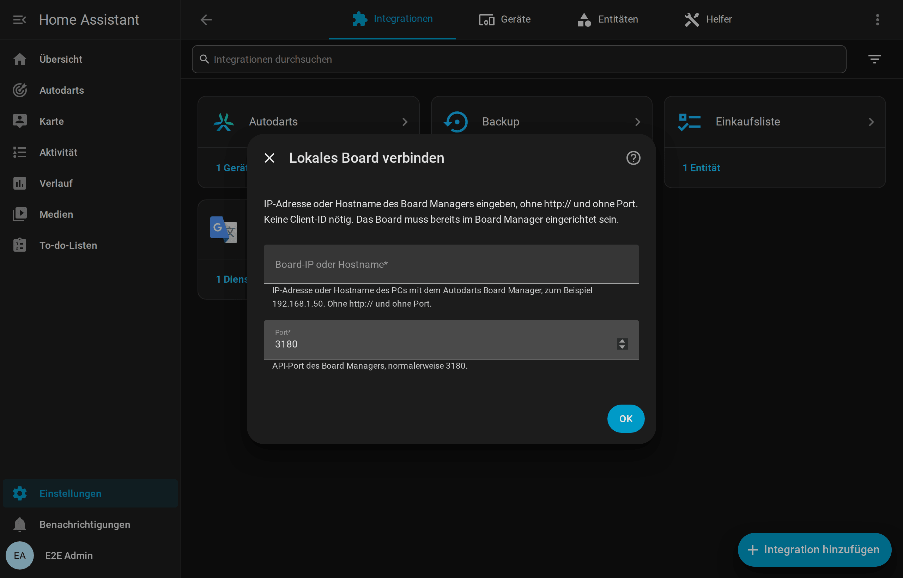

# Installation und Einrichtung

[← Übersicht](README.md) · [English](../installation.md)

## Voraussetzungen

| Voraussetzung | Details |
| --- | --- |
| Home Assistant | **2026.8** oder neuer |
| Autodarts-Board | Im Autodarts Board Manager eingerichtet und funktionsfähig: **Board Manager 2** (Headless, empfohlen) oder der klassische **Board Manager 1** |
| Netzwerk | Home Assistant erreicht den Board-PC im lokalen Netzwerk, standardmäßig über TCP-Port **3180** |
| Optional: Cloud-Spieldaten | Ein Autodarts-Konto und eine OAuth-Client-ID, die Autodarts für diese Integration vergibt (siehe [Cloud-Verknüpfung](#autodarts-cloud-verknüpfen-optional)) |

Für die lokale Nutzung braucht die Integration **keine Autodarts-Anmeldung, kein Passwort und keinen API-Schlüssel**. Die Registrierung deines Boards bei Autodarts bleibt unverändert.

## Installieren

### Mit HACS (empfohlen)

1. Öffne **HACS** in Home Assistant.
2. Öffne das Menü (⋮) → **Benutzerdefinierte Repositories**. Füge `https://github.com/Dennis-Otto/HACSAutodarts` mit dem Typ **Integration** hinzu.
3. Suche nach **Autodarts**, öffne es und wähle **Herunterladen**.
4. Starte Home Assistant neu.

Neue Versionen zeigt HACS als Update unter **Einstellungen → Updates** an, samt Versionshinweisen.

### Manuell

1. Lade die neueste Version von [GitHub](https://github.com/Dennis-Otto/HACSAutodarts/releases) herunter.
2. Kopiere den Ordner `custom_components/autodarts` in den Ordner `custom_components` deiner Home-Assistant-Konfiguration. Danach gibt es `config/custom_components/autodarts/manifest.json`.
3. Starte Home Assistant neu.

## Board hinzufügen

Es gibt drei Wege; alle führen zum selben, vollständig lokalen Board.

### 1. Automatische Erkennung (Board Manager 2)

Board Manager 2 meldet sich selbst im Netzwerk (mDNS, `_autodarts-board._tcp`). Home Assistant zeigt dann **Autodarts-Board gefunden** unter **Einstellungen → Geräte & Dienste → Entdeckt**. Wähle **Hinzufügen** und bestätige. Der Dialog nennt Adresse, Board-Manager-Version und Anzahl der Kameras.

Bekommt das Board später eine neue IP-Adresse, übernimmt die Integration sie automatisch aus der Ankündigung.

### 2. Boards im Netzwerk suchen

Wähle **Boards im Netzwerk suchen**. Die Integration fragt den öffentlichen Autodarts-Suchdienst, den auch die Board-Manager-App nutzt, welche Boards von deinem Internetanschluss aus registriert sind. Du wählst dein Board, und die Integration verbindet sich lokal mit ihm.

> Der Suchdienst sieht wie jede Website deine öffentliche IP-Adresse; sonst wird nichts übertragen. Ist der Dienst nicht erreichbar oder findet er kein neues Board, öffnet sich stattdessen das Adressformular.

### 3. Board-Adresse eingeben

Wähle **Board-Adresse eingeben** und trage die IP-Adresse oder den Hostnamen des Board-PCs ein, zum Beispiel `192.168.1.50` oder `autodarts.local`. Lass `http://` und den Port weg. Der Port ist normalerweise **3180**.

Die Board-ID liest die Integration selbst aus. Nicht erreichbare Adressen und Boards ohne abgeschlossene Einrichtung werden abgelehnt.

> **Tipp:** Gib dem Board-PC in deinem Router eine feste IP-Adresse. Mit Board Manager 2 hält die automatische Erkennung die Adresse ohnehin aktuell.

### Nach der Einrichtung

Home Assistant legt ein Gerät mit dem Namen deines Boards und allen [Entitäten](entitaeten.md) an. Die Karten findest du unter **Karte hinzufügen → Autodarts**; siehe [Dashboard-Karten](karten.md).

## Autodarts-Cloud verknüpfen (optional)

Mit einem verknüpften Autodarts-Konto kommen Spieldaten aus der Cloud dazu: Spielmodus, Spielstatus, Runde, Punkte der Aufnahme und geworfene Darts. Die lokale Steuerung hängt nicht davon ab. Sie funktioniert weiter, wenn die Cloud nicht erreichbar ist oder die Anmeldung abläuft.

> **Stand:** Für die Verknüpfung braucht es eine öffentliche OAuth-Client-ID mit Geräteanmeldung, die Autodarts für diese Integration vergibt. Sie ist beantragt, aber noch nicht enthalten. Bis dahin lässt sich die Verknüpfung nicht abschließen. Alles Lokale funktioniert ohne sie.

So läuft es mit einer Client-ID ab:

1. Wähle bei der Einrichtung **Cloud-Konto verknüpfen**. Bei einem bestehenden Board wählst du **Neu konfigurieren → Cloud-Konto verknüpfen**.
2. Trage die Client-ID ein, optional auch die lokale Adresse des Boards.
3. Home Assistant zeigt einen Code wie `ABCD-EFGH` und einen Link. Öffne den Link auf einem beliebigen Gerät, melde dich bei Autodarts an und bestätige den Code.
4. Home Assistant macht selbstständig weiter. Hat dein Konto mehrere Boards, wählst du eines aus.

Dein Passwort sieht Home Assistant nie. Die Token erneuern sich automatisch. Läuft eine Anmeldung ab oder wird sie widerrufen, bittet Home Assistant um eine **erneute Anmeldung**; die lokale Steuerung läuft währenddessen weiter.

## Neu konfigurieren

Öffne **Einstellungen → Geräte & Dienste → Autodarts** und im Menü des Boards (⋮) **Neu konfigurieren**. Du kannst dort:

- das Board neu suchen oder eine neue Adresse eintragen, etwa nach einer Netzwerkänderung;
- die Cloud-Verknüpfung hinzufügen oder erneuern.

Board, Entitäten, Verlauf und Dashboards bleiben erhalten. Eine Adresse oder ein Konto, das zu einem anderen Board gehört, lehnt die Integration ab.

## Von Board Manager 1 auf Board Manager 2 umsteigen

Autodarts ersetzt den klassischen Board Manager durch den Headless **Board Manager 2** und schaltet die alte Version ab, sobald die meisten Spieler umgestiegen sind. Solange ein Board noch Board Manager 1 nutzt, zeigt Home Assistant einen **Reparaturhinweis**.

1. Installiere Board Manager 2 nach der Anleitung von Autodarts auf dem Board-PC.
2. An der Integration musst du nichts ändern. Sie erkennt die neue Generation beim nächsten Lesen, lädt sich neu und ergänzt die neuen Entitäten: Cloud-Verbindung, CPU, Speicher und Update.
3. Entitäten, die es nur bei Board Manager 1 gibt, etwa der Schalter für die Board-Cloud-Verbindung, werden automatisch entfernt.

Trainingssession, Entitäts-IDs und Dashboards bleiben erhalten.

## Von der ursprünglichen Integration umsteigen

Diese Integration nutzt dieselbe Domain `autodarts` wie [Trkal/HACSAutodarts](https://github.com/Trkal/HACSAutodarts); deshalb kann nur eine der beiden installiert sein.

1. Entferne in HACS das ursprüngliche Repository und füge dieses hinzu, wie unter [Installieren](#mit-hacs-empfohlen) beschrieben. Alternativ ersetzt du `config/custom_components/autodarts` von Hand.
2. Starte Home Assistant neu und behalte den bestehenden Eintrag unter **Geräte & Dienste**.

Einträge der ersten Version, die eine Adresse oder ein Kontopasswort gespeichert hatten, werden automatisch umgestellt; das Passwort wird dabei gelöscht. Ist das Board während des Updates aus, wird die Umstellung beim nächsten Start wiederholt. Einträge mit der alten Autodarts-Anmeldung bitten um eine erneute Anmeldung; die lokale Steuerung funktioniert solange weiter.

## Entfernen

1. Öffne **Einstellungen → Geräte & Dienste → Autodarts**, im Menü des Boards (⋮) wählst du **Löschen**. Dabei werden auch die gespeicherte Trainingssession und alle Reparaturhinweise des Boards gelöscht.
2. Um den Code zu deinstallieren, öffnest du **Autodarts** in HACS und wählst **Entfernen**. Bei einer manuellen Installation löschst du `config/custom_components/autodarts`.
3. Starte Home Assistant neu. Die Dashboard-Karten verschwinden mit der Integration. Entferne Karten und Automationen, die sie verwenden.

Am Board selbst ändert die Integration nichts; es funktioniert danach wie zuvor.
