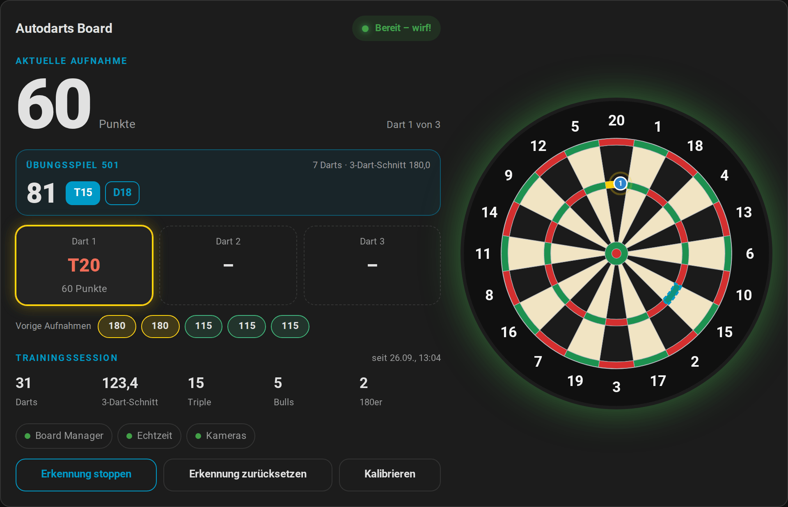
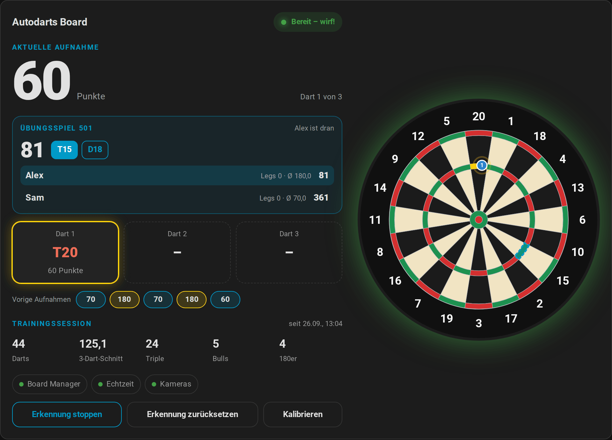
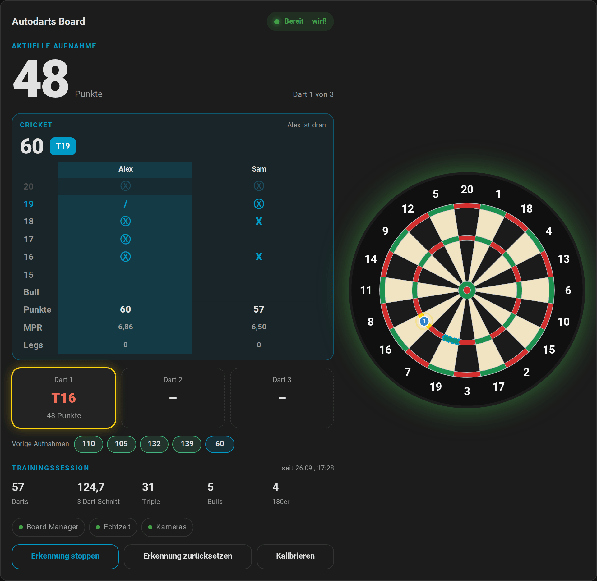
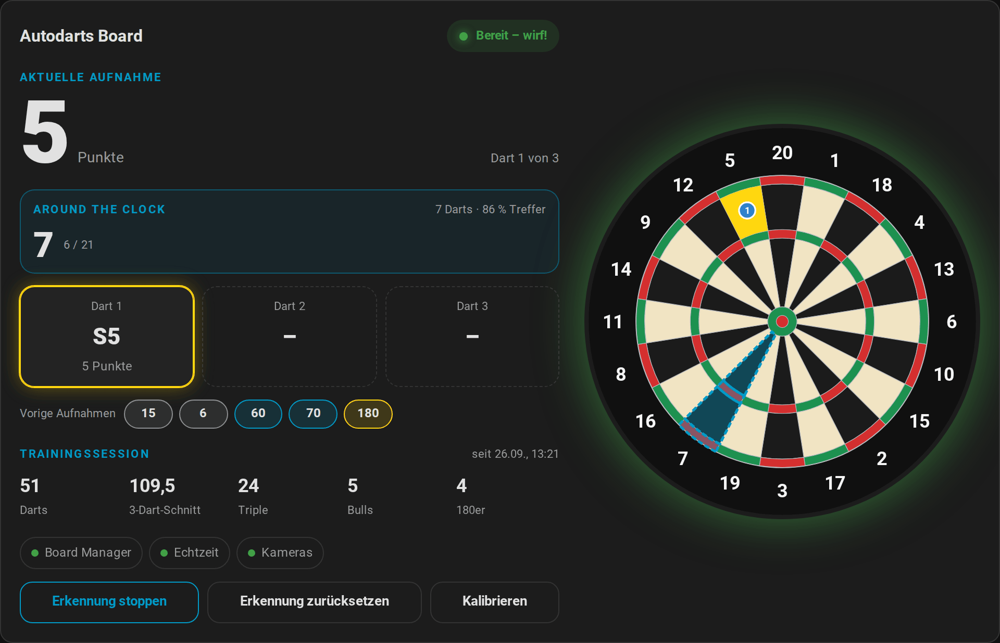
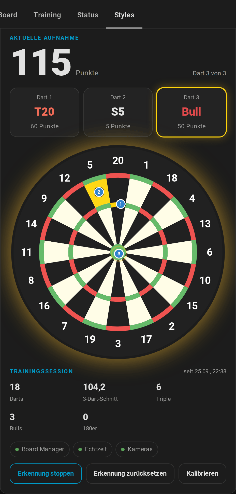
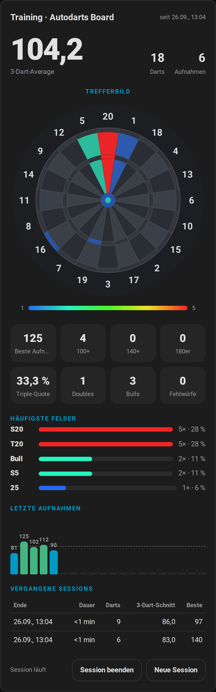
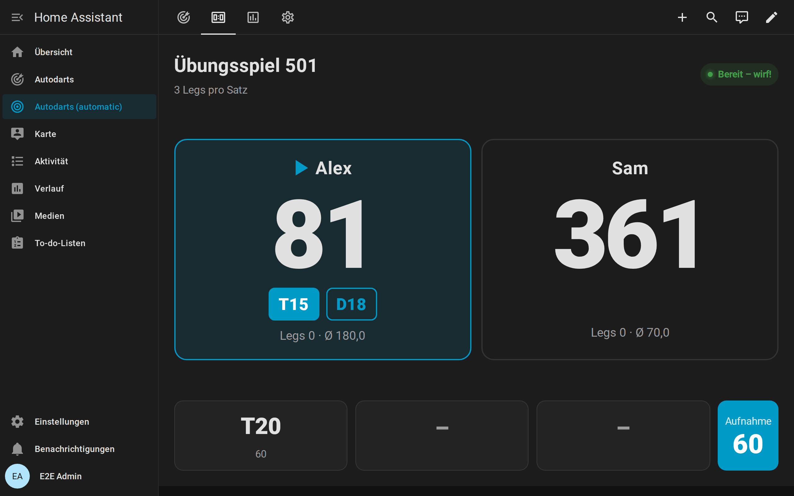
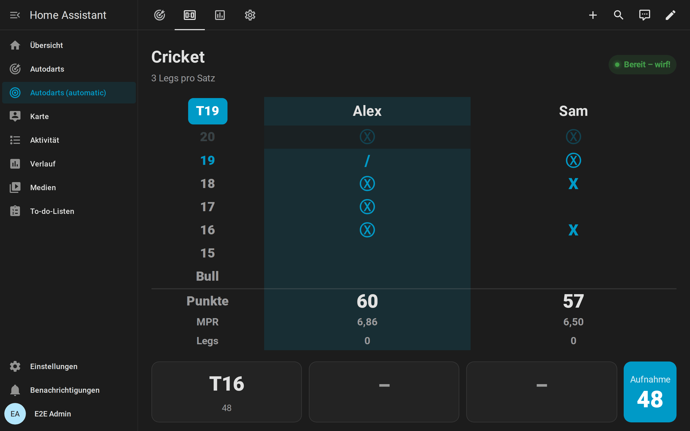
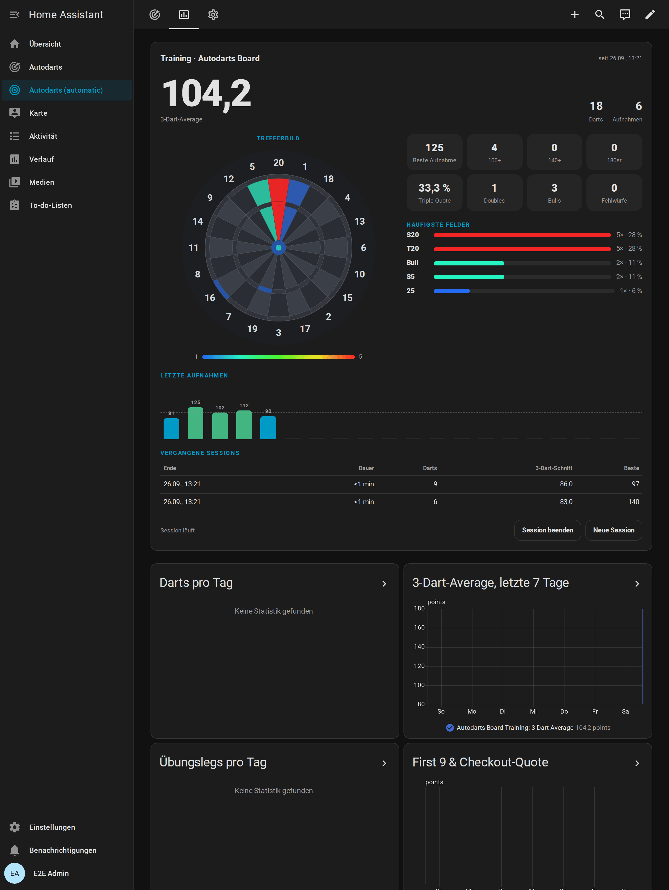
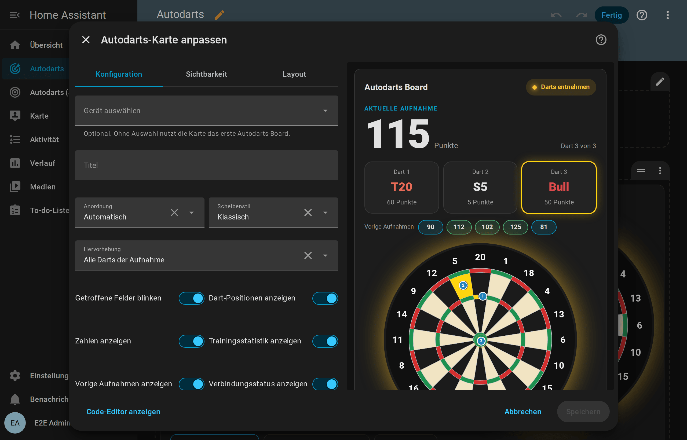

# Dashboard-Karten

[← Übersicht](README.md) · [English](../cards.md)

Die Integration bringt vier Karten mit. Home Assistant lädt sie automatisch; eine Dashboard-Ressource oder ein eigener HACS-Download ist nicht nötig. Jede Karte:

- hat einen visuellen Editor und folgt deinem Design (hell oder dunkel) und deiner Sprache;
- passt sich ihrer Breite an, vom Handy bis zum Wandtablet;
- findet dein Board selbst. Bei mehreren Boards wählst du eines im Editor aus.

Zum Hinzufügen bearbeitest du ein Dashboard, wählst **Karte hinzufügen** und suchst nach **Autodarts**.

## Live-Karte

`custom:autodarts-card` zeigt die aktuelle Aufnahme Dart für Dart auf einer Scheibe mit der Geometrie des Autodarts Board Managers.


- **Aufnahme:** Punkte, die drei Dart-Felder und der Fortschritt. Der jüngste Dart ist hervorgehoben.
- **Vorige Aufnahmen:** die Punkte deiner letzten fünf Aufnahmen, eingefärbt wie im Diagramm der Trainingskarte. Mit dem Mauszeiger siehst du die Darts.
- **Übungsspiel:** Läuft ein [Übungsspiel](entitaeten.md#übungsspiel), stehen Restpunkte, Checkout-Weg und Überwerfen über den Dart-Feldern, und die Scheibe umrandet das nächste Zielfeld. Im Match listet eine Anzeigetafel alle Spieler mit Restpunkten, Legs, Sätzen und Average und hebt den Spieler am Board hervor. Bei [Cricket](entitaeten.md#cricket) zeigt eine Kreidetafel die Treffer aller Spieler auf 20 bis 15 und dem Bull, die Punkte und die Treffer pro Runde, blendet Zahlen ab, die alle geschlossen haben, und umrandet die nächste offene Zahl auf der Scheibe. In einem [Trainingsspiel](entitaeten.md#trainingsspiele) zeigt der Bereich Ziel, Fortschritt, Darts und Trefferquote (Bob's 27: Punkte und Runde; Checkout-Training: Weg und Checkout-Quote), und die Scheibe umrandet die Felder des Ziels.
- **Scheibe:**
  - Getroffene Felder blinken in der Hervorhebungsfarbe.
  - Nummerierte Markierungen zeigen, wo jeder Dart steckt.
  - Die Scheibe leuchtet in der Farbe des Erkennungsstatus: grün für bereit, gelb bei der Entnahme, orange bei gestoppter Erkennung, lila bei der Kalibrierung, rot bei einer Störung oder ohne Verbindung.
- **Trainingsstatistik:** Darts, 3-Dart-Schnitt, Triple, Bulls und 180er der Session.
- **Verbindungen:** Board Manager, Echtzeit und Kameras; ein Tipp öffnet die Details.
- **Steuerung:** Erkennung starten oder stoppen, zurücksetzen und kalibrieren. Zurücksetzen und Kalibrieren brauchen einen zweiten Tipp zur Bestätigung.

Ein Tipp auf die Scheibe, oder die Eingabetaste darauf, öffnet die Details der Aufnahme.










### Optionen

| Option | Werte | Standard | Beschreibung |
| --- | --- | --- | --- |
| `device_id` | Gerät | erstes Board | Das angezeigte Board |
| `title` | Text | Board-Name | Kartentitel |
| `layout` | `auto`, `horizontal`, `vertical`, `board` | `auto` | Scheibe rechts, Scheibe unten oder nur die Scheibe. `auto` wechselt bei schmalen Karten auf unten |
| `board_style` | `classic`, `autodarts` | `classic` | Klassische Scheibe mit Drähten oder der flache Autodarts-Stil |
| `highlight` | `visit`, `last`, `none` | `visit` | Alle Darts der Aufnahme, nur den letzten oder keinen hervorheben |
| `blink` | Wahrheitswert | `true` | Getroffene Felder blinken |
| `show_markers` | Wahrheitswert | `true` | Dart-Positionen anzeigen |
| `show_numbers` | Wahrheitswert | `true` | Zahlen um die Scheibe anzeigen |
| `show_stats` | Wahrheitswert | `true` | Trainingsstatistik anzeigen |
| `show_recent` | Wahrheitswert | `true` | Vorige Aufnahmen anzeigen |
| `show_practice` | Wahrheitswert | `true` | Übungsspiel und nächstes Zielfeld anzeigen |
| `show_connection` | Wahrheitswert | `true` | Verbindungen anzeigen |
| `show_controls` | Wahrheitswert | `true` | Steuerung anzeigen |
| `accent_color` | CSS-Farbe | Primärfarbe des Designs | Beschriftungen und Haupttaste |
| `highlight_color` | CSS-Farbe | `#ffd60a` | Getroffene Felder und jüngster Dart |

<table>
  <tr>
    <td></td>
    <td></td>
  </tr>
  <tr>
    <td align="center"><code>layout: vertical</code>, <code>board_style: autodarts</code></td>
    <td align="center"><code>layout: board</code></td>
  </tr>
</table>

```yaml
type: custom:autodarts-card
layout: vertical
board_style: autodarts
highlight: last
highlight_color: "#00e5ff"
```

## Trainingskarte

`custom:autodarts-training-card` macht aus der lokalen [Trainingssession](entitaeten.md#trainingssession) ein Dashboard, das du nach jedem Training ansehen willst.


- **3-Dart-Average**, Anzahl der Darts und Aufnahmen und der Beginn der Session.
- **Trefferbild:**
  - Jedes Feld ist nach Trefferhäufigkeit eingefärbt, von blau (selten) bis rot (am häufigsten).
  - Mit dem Mauszeiger auf einem Feld siehst du Anzahl und Anteil.
  - Im Modus `numbers` werden Single, Double und Triple jeder Zahl zusammengefasst.
- **Statistik:** beste Aufnahme, 100+, 140+ und 180er, Triple-Quote, Doubles, Bulls und Fehlwürfe. 180er leuchten golden.
- **Häufigste Felder:** die fünf meistgetroffenen Felder mit Anzahl und Anteil an allen Darts.
- **Letzte Aufnahmen:** ein Balkendiagramm deiner letzten Aufnahmen mit dem Schnitt der Session als gestrichelter Linie.
  - Farben: grau unter 60, Akzentfarbe ab 60, grün ab 100, orange ab 140 und gold für 180.
  - Die Aufnahmen kommen aus dem Recorder und bleiben daher auch nach dem Neuladen der Seite erhalten.
- **Vergangene Sessions:** Ende, Dauer, Darts, 3-Dart-Schnitt und beste Aufnahme deiner letzten fünf beendeten Sessions.
- **Session-Steuerung:**
  - *Session starten* und *Session beenden* schalten die [Trainingssession](entitaeten.md#trainingssession) ein und aus. Das Beenden braucht einen zweiten Tipp zur Bestätigung.
  - *Neue Session* beendet die laufende Session und startet die nächste, ebenfalls nach einem zweiten Tipp.
  - Die Zeile neben den Tasten zeigt, ob eine Session läuft oder wann die letzte endete.

### Optionen

| Option | Werte | Standard | Beschreibung |
| --- | --- | --- | --- |
| `device_id` | Gerät | erstes Board | Das angezeigte Board |
| `title` | Text | *Training · Board-Name* | Kartentitel |
| `mode` | `beds`, `numbers` | `beds` | Trefferbild pro Feld oder pro Zahl |
| `board_style` | `muted`, `classic`, `autodarts` | `muted` | Die dezente Scheibe lässt das Trefferbild hervortreten |
| `history_size` | 5–60 | `20` | Aufnahmen im Diagramm; Zahlen stehen bis 30 Aufnahmen darüber |
| `show_heatmap` | Wahrheitswert | `true` | Trefferbild anzeigen |
| `show_stats` | Wahrheitswert | `true` | Statistik anzeigen |
| `show_top` | Wahrheitswert | `true` | Häufigste Felder anzeigen |
| `show_history` | Wahrheitswert | `true` | Letzte Aufnahmen anzeigen |
| `show_sessions` | Wahrheitswert | `true` | Vergangene Sessions anzeigen |
| `show_reset` | Wahrheitswert | `true` | Session-Steuerung anzeigen |
| `accent_color` | CSS-Farbe | Primärfarbe des Designs | Beschriftungen und Aufnahmen ab 60 |

```yaml
type: custom:autodarts-training-card
mode: numbers
history_size: 40
show_reset: false
```



## Board-Status

`custom:autodarts-status-card` zeigt den Zustand des Boards und bündelt die Wartung an einem Ort.


- **Erkennung:** ein Schalter mit dem aktuellen Status, eingefärbt in der Statusfarbe.
- **Board Manager:** die installierte Version. Mit Board Manager 2 zeigt ein Hinweis ein verfügbares Update an; ein Tipp darauf öffnet die Details.
- **Verbindungen:** Board Manager, Echtzeit und die Cloud-Verbindung des Boards.
- **Board-PC** (Board Manager 2): CPU- und Speicherlast, dazu die Erkennungsbildrate, wenn du sie aktiviert hast.
- **Kameras:** eine Kachel pro Kamera mit Status, Bildrate (wenn der Bildraten-Sensor aktiv ist) und eigener Kalibrierung. Eine gestörte Kamera wird rot.
- **Wartung:** Kalibrieren, Erkennung zurücksetzen und Board Manager neu starten, jeweils mit zweitem Tipp zur Bestätigung.

### Optionen

| Option | Werte | Standard | Beschreibung |
| --- | --- | --- | --- |
| `device_id` | Gerät | erstes Board | Das angezeigte Board |
| `title` | Text | Board-Name | Kartentitel |
| `show_connection` | Wahrheitswert | `true` | Verbindungen anzeigen |
| `show_system` | Wahrheitswert | `true` | Board-PC anzeigen |
| `show_cameras` | Wahrheitswert | `true` | Kameras anzeigen |
| `show_controls` | Wahrheitswert | `true` | Wartungstasten anzeigen |
| `accent_color` | CSS-Farbe | Primärfarbe des Designs | Beschriftungen und Erkennungsschalter |

## Anzeigetafel

`custom:autodarts-scoreboard-card` ist für ein Tablet oder einen Fernseher neben dem Board gemacht: groß genug, um sie vom Abwurf aus zu lesen, und sie zeigt immer, was gerade gespielt wird.



- **X01:** eine Kachel pro Spieler mit Restpunkten, Legs, Sätzen und Average. Der Spieler am Board ist hervorgehoben und bekommt den Checkout-Weg, das Überwerfen oder das Game shot.
- **Cricket:** eine große Kreidetafel mit den Treffern aller Spieler, den Punkten und den Treffern pro Runde; darunter steht die nächste offene Zahl.
- **Trainingsspiele:** das Ziel in großer Schrift mit Fortschritt, Darts und Trefferquote (Bob's 27: Punkte und Runde; Checkout-Training: Rest, Weg und Checkout-Quote).
- **Zwischen den Spielen:** die Punkte der aktuellen Aufnahme zusammen mit Darts, 3-Dart-Average, bester Aufnahme und 180ern der Trainingssession.
- **Sieger:** Ein Banner nennt den Matchgewinner bis zum nächsten Dart.
- **Aufnahme:** Unten stehen die drei Darts der aktuellen Aufnahme und ihre Punkte.



Das [automatische Dashboard](#automatisches-dashboard) hat eine Ansicht *Anzeigetafel*, die die Karte über den ganzen Bildschirm zeigt. Öffne sie auf dem Tablet und nutze den Vollbildmodus des Browsers oder die Home-Assistant-App im Kioskmodus.

### Optionen

| Option | Werte | Standard | Beschreibung |
| --- | --- | --- | --- |
| `device_id` | Gerät | erstes Board | Das anzuzeigende Board |
| `full_height` | Wahrheitswert | `false` | Die Höhe des Bildschirms füllen, für eine Ansicht im Panel-Modus |
| `show_visit` | Wahrheitswert | `true` | Die Darts der aktuellen Aufnahme anzeigen |
| `show_status` | Wahrheitswert | `true` | Den Board-Status anzeigen |
| `accent_color` | CSS-Farbe | Primärfarbe des Designs | Spieler am Board, Wege und Aufnahmepunkte |

```yaml
type: custom:autodarts-scoreboard-card
full_height: true
```

## Automatisches Dashboard

Statt die Karten selbst anzuordnen, kann die Integration ein komplettes Dashboard erzeugen:

1. Öffne **Einstellungen → Dashboards → Dashboard hinzufügen**.
2. Wähle **Autodarts**.

Pro Board entstehen vier Ansichten. Sie aktualisieren sich selbst, wenn du ein Board hinzufügst oder Entitäten aktivierst:

| Ansicht | Inhalt |
| --- | --- |
| **Live** | Die Live-Karte über die volle Breite, die Steuerung des Übungsspiels und die Spielernamen |
| **Anzeigetafel** | Die [Anzeigetafel](#anzeigetafel) über den ganzen Bildschirm, für ein Tablet oder einen Fernseher am Board |
| **Training** | Die Trainingskarte, Darts pro Tag der letzten 30 Tage (aus den Langzeitstatistiken, die Home Assistant stündlich berechnet), der 3-Dart-Average der letzten 7 Tage, Übungslegs pro Tag sowie First-9-Average und Checkout-Quote des Übungsspiels |
| **Board** | Der Board-Status, die Board-Einstellungen und das Board-Manager-Update |



In YAML ist das ganze Dashboard eine Zeile; `device_id` und `title` sind optional:

```yaml
strategy:
  type: custom:autodarts
  device_id: 0123456789abcdef   # nur dieses Board
  title: Darts
```

Zum Anpassen öffnest du im Dashboard das Menü (⋮) → **Dashboard bearbeiten** → **Kontrolle übernehmen**. Home Assistant macht aus den erzeugten Ansichten dann ein normales, frei bearbeitbares Dashboard.

## Karteneditor

Alle Optionen lassen sich im visuellen Editor einstellen; die Geräteauswahl bietet nur Autodarts-Boards an.



## Tipps

- **Wandtablet:** Die Live-Karte mit `layout: vertical` füllt einen Bildschirm im Hochformat; die Scheibe skaliert mit. Für einen Bildschirm im Querformat am Board nimm die [Anzeigetafel](#anzeigetafel).
- **Kombinieren:** Setze Live-Karte und Trainingskarte in einer Abschnittsansicht mit zwei Spalten nebeneinander.
- **Mehrere Boards:** Lege pro Board eine Karte an und wähle das Board im Editor der Karte.
- **Alte Version im Cache:** Nach einem Update ändert sich die Adresse der Karte automatisch. Zeigt ein Browser trotzdem eine alte Karte, lade die Seite neu. In der Companion-App hilft *Einstellungen → Companion-App → Fehlerbehebung → Frontend-Cache zurücksetzen*.
