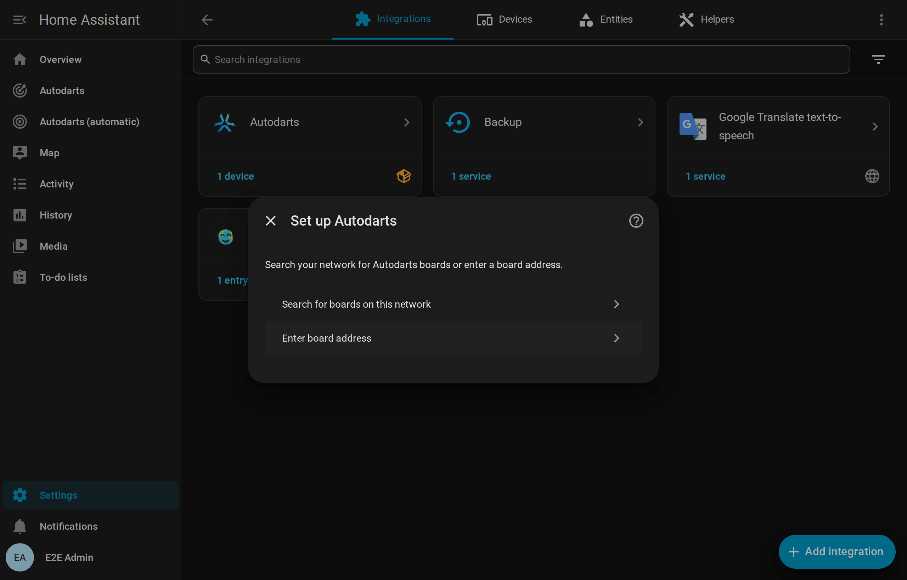
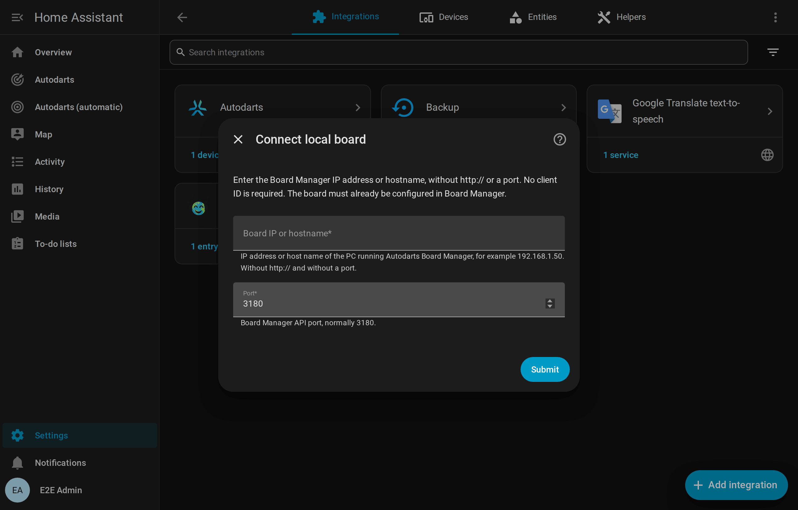

# Installation and setup

[← Documentation](README.md) · [Deutsch](de/installation.md)

## Requirements

| Requirement | Details |
| --- | --- |
| Home Assistant | **2026.8** or newer |
| Autodarts board | Set up and working in the Autodarts Board Manager: **Board Manager 2** (headless, recommended) or the classic **Board Manager 1** |
| Network | Home Assistant reaches the board PC on the local network, TCP port **3180** by default |
| Optional: cloud match data | An Autodarts account and an OAuth client ID that Autodarts issues for this integration (see [cloud link](#link-the-autodarts-cloud-optional)) |

The integration needs **no Autodarts login, password or API key** for local use. It never changes your board's registration with Autodarts.

## Install

### With HACS (recommended)

1. Open **HACS** in Home Assistant.
2. Open the menu (⋮) → **Custom repositories**, add `https://github.com/Dennis-Otto/HACSAutodarts` with the type **Integration**, and select **Add**.
3. Search for **Autodarts**, open it and select **Download**.
4. Restart Home Assistant.

HACS shows new versions as an update in **Settings → Updates**. The update dialog shows the release notes.

### Manually

1. Download the latest release from [GitHub](https://github.com/Dennis-Otto/HACSAutodarts/releases).
2. Copy the folder `custom_components/autodarts` into the `custom_components` folder of your Home Assistant configuration. The result is `config/custom_components/autodarts/manifest.json`.
3. Restart Home Assistant.

## Add your board

There are three ways to add a board. All of them end with the same, fully local board.

### 1. Automatic discovery (Board Manager 2)

Board Manager 2 announces itself on the network (mDNS, `_autodarts-board._tcp`). Home Assistant then shows **Autodarts board found** under **Settings → Devices & services → Discovered**. Select **Add** and confirm. The dialog names the address, the Board Manager version and the number of cameras.

If the board later gets a new IP address, the announcement updates the configured address automatically.

### 2. Search for boards on this network

Choose **Search for boards on this network**. The integration asks the public Autodarts discovery service, which the Board Manager app uses as well, which boards are registered from your internet connection. Pick your board, and the integration connects to it locally.

> The discovery service sees your public IP address, like any website. Nothing else is sent. If the service is unavailable or finds no new board, the address form opens instead.

### 3. Enter the board address

Choose **Enter board address** and enter the IP address or host name of the board PC, for example `192.168.1.50` or `autodarts.local`, without `http://` and without a port. The port is normally **3180**.

The integration reads the board ID from the Board Manager. It rejects addresses that are not reachable or that have no board set up yet.

> **Tip:** give the board PC a fixed IP address in your router. With Board Manager 2, discovery keeps the address up to date anyway.

### After setup

Home Assistant creates one device, named after your board, with all [entities](entities.md). On a new dashboard the cards appear under **Add card → Autodarts**; see the [card guide](cards.md).

## Link the Autodarts cloud (optional)

Linking your Autodarts account adds cloud match data: game mode, match state, round, visit score and darts thrown. Local control does not depend on it and keeps working if the cloud is unreachable or the login expires.

> **Status:** linking needs a public OAuth client ID with device authorization that Autodarts issues for this integration. It has been requested and is not bundled yet. Until then, setup and **Reconfigure** do not offer the cloud link. Everything local works without it.

How it will work once the client ID is available:

1. Choose **Link cloud account** during setup, or **Reconfigure → Link cloud account** on an existing board.
2. Home Assistant shows a code such as `ABCD-EFGH` and a link. Open the link on any device, sign in to Autodarts and approve the code.
3. Home Assistant continues on its own. If your account has several boards, choose one.

Home Assistant never sees your password. Tokens refresh automatically. If a login expires or is revoked, Home Assistant asks you to **re-authenticate**, and local control keeps working meanwhile.

## Reconfigure

Open **Settings → Devices & services → Autodarts**, select the board's menu (⋮) → **Reconfigure**. You can:

- search for the board again or enter a new address, for example after a network change;
- add or renew the cloud link, once it is available.

The board, its entities, their history and your dashboards stay as they are. The integration refuses an address or account that belongs to a different board.

## Update from Board Manager 1 to Board Manager 2

Autodarts replaces the classic Board Manager with the headless **Board Manager 2** and will turn the old one off once most players have migrated. Home Assistant shows a **repair notice** as long as a board runs Board Manager 1.

1. Install Board Manager 2 on the board PC as described by Autodarts.
2. Keep the integration as it is. It detects the new generation on the next read, reloads itself and adds the new entities: cloud connection, CPU, memory and update.
3. Entities that only Board Manager 1 has, such as the board cloud link switch, are removed automatically.

Your training session, entity IDs and dashboards are kept.

## Update from the original integration

This integration uses the same `autodarts` domain as [Trkal/HACSAutodarts](https://github.com/Trkal/HACSAutodarts), so only one of them can be installed.

1. In HACS, remove the original repository and add this one, as described under [Install](#with-hacs-recommended). Alternatively, replace `config/custom_components/autodarts` manually.
2. Restart Home Assistant and keep the existing entry in **Devices & services**.

Entries of the first version, which stored an address or an account password, are migrated automatically, and the password is deleted. If the board is switched off during the update, the migration is retried at the next start. Entries that used the retired Autodarts login keep working locally. If such an entry has no board address, Home Assistant asks you to enter it with **Reconfigure**.

## Remove

1. **Settings → Devices & services → Autodarts**, open the board's menu (⋮) and select **Delete**. This also deletes the stored training session and all repair notices of the board.
2. To uninstall the code: in **HACS**, open **Autodarts** and select **Remove**. For a manual installation, delete `config/custom_components/autodarts`.
3. Restart Home Assistant. The dashboard cards disappear with the integration. Remove dashboard cards and automations that use them.

The integration changes nothing on the board, so the board keeps working as before.
